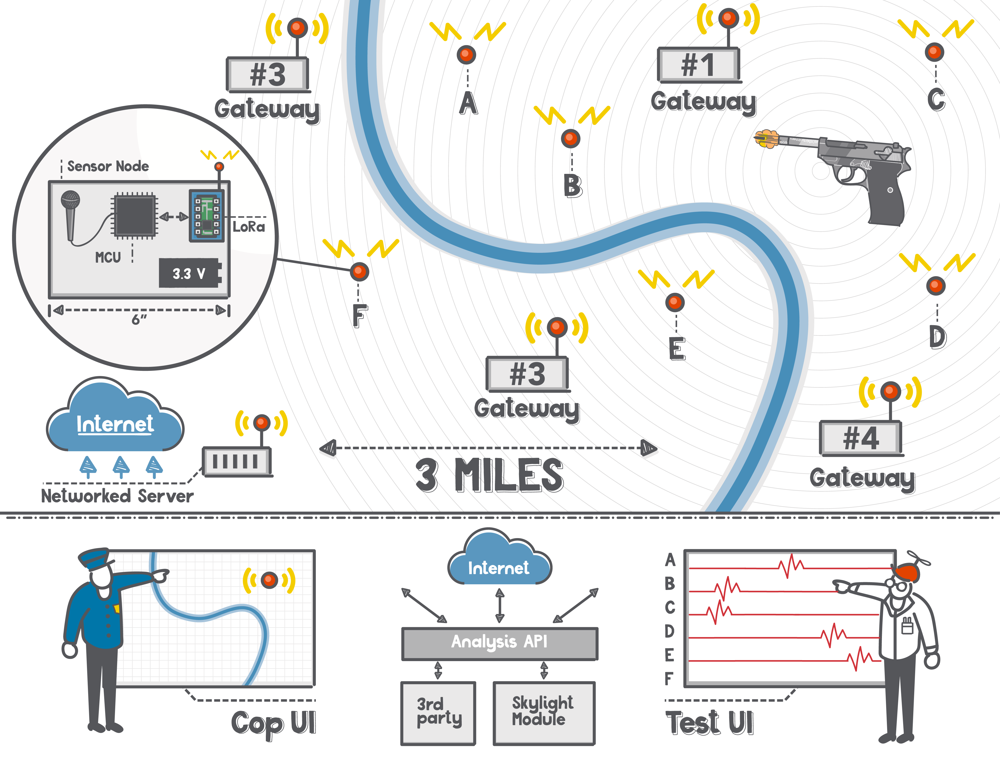
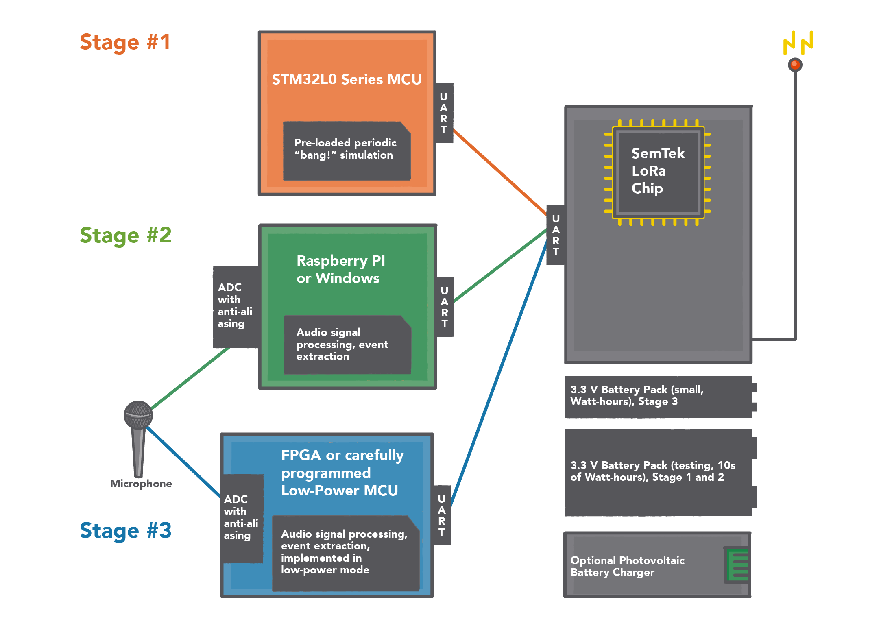

# Dense Sense - Dense, Cheap Network of Ephemeral Low Power Wide Area Network Sensors

## 1.0 Administrative Information

<table>
  <tbody>
    <tr>
      <td><strong>Solicitation Reference</strong></td>
      <td>Defense Advanced Research Projects Agency / Microsystems Technology Office / Commercial Performer Program Announcement / DARPA-PA-17-01</td>
    </tr>
    <tr>
      <td><strong>Lead Organization</strong></td>
      <td>Skylight Digital LLC</td>
    </tr>
    <tr>
      <td><strong>Subcontractors / Teaming Arrangements</strong></td>
      <td>Execution of the proposed work will involve several third parties, as listed in the Dense Sense Cost Model (see email Excel attachment). Formal arrangements will be executed upon selection notification.</td>
    </tr>
    <tr>
      <td><strong>Administrative Point of Contact</strong></td>
      <td>Chris Cairns</td>
    </tr>
    <tr>
      <td><strong>Technical Point of Contact</strong></td>
      <td>Geoff Mulligan</td>
    </tr>
    <tr>
      <td><strong>Title of Proposed Effort</strong></td>
      <td>Dense Sense - Dense, Cheap Network of Ephemeral Low Power Wide Area Network Sensors</td>
    </tr>
    <tr>
      <td><strong>Technical Area</strong></td>
      <td>Internet of Things, Low Power Wide Area Network Sensors, Cloud-based Open Data and Analytics Platform</td>
    </tr>
    <tr>
      <td><strong>Place and Period of Performance</strong></td>
      <td>Colorado Springs, CO; 12 months from the date of contract execution</td>
    </tr>
    <tr>
      <td><strong>DUNS #</strong></td>
      <td>080202677</td>
    </tr>
  </tbody>
</table>

## 2.0 Background Information

With newer Low Power Wide Area Networking (LPWAN) technology it is now possible to build a network of battery powered or energy harvesting sensors that can be placed unobtrusively and easily throughout a city or target area. Because these can be inexpensive and use little power, it is economical to deploy a very large number of sensors, which we call a "dense" sensor network.

One example of this new class of sensors can capture and transmit simple audio waveforms to a cloud service where they are analyzed, disambiguated, and triangulated to identify both the type and location and time of a particular "noise." These "noises" can then be categorized, in the cloud, and if determined to be a gunshot, the information would be relayed to the appropriate agencies and potentially other sensor systems. Other sensor types could transmit various other telemetry data such as temp, vibration, radiation, air quality, light, or even human factors such as heart rate, respiration, or body temperature. The purpose of this project is to investigate, experiment with, develop, and deploy a simple, low cost, low power sensor network as an open source and open protocol based platform to relay audio waveforms and triangulated location information to an offsite audio analysis cloud for classification and alert actions.

An additional advantage of moving the final processing to the cloud is that it offers protection of sensitive algorithms and data against penetration attempts. The field units can be restricted to relatively elementary functionality which is indifferent to compromise.

## 3.0 Technical Area

### 3.1 Goals

The overall goal of the project is to prototype and prove the workability of coordinated, numerous low power sensors systems with a particular test case of audio reception and transmission for identification and location of particular sounds such as gunshots. The final system will be low cost; that is, two orders of magnitude less expensive in CAPEX, installation, and OPEX compared to existing approaches and will use capabilities of open standards including 6LoWPAN, IP/TCP, COAP, MQTT, and HTTP for sensor communications. The system will allow third parties to integrate their own expertise via a published cloud application programming interface (API) to provide for improved data analysis, classification, and alerting.

In the course of building a functioning system, we will necessarily test and verify:

* Radio Frequency (RF) packet multicasting, and communication confidentiality, integrity, and authentication for low power RF connected sensor system
* Prototype and demonstrate use of open standards for sensor networks (6LoWPAN, IP/TCP, COAP, MQTT, and HTTP)
* Packet reception timing coordination, high accuracy node time coordination
* Autonomous sensor node geolocation
* Autonomous audio target geolocation
* Audio signal processing tradeoffs
* Efficient data transmission (simple lossless compression)
* Efficient and easily deployed RF transmission (using a star topology)

### 3.2 Current state of the art

There are a number of different RF technologies available today, but most trade off low power for limited distance and therefore require multi-hop mesh networking architectures. These designs increase network complexity; no truly and easily scalable sleeping mesh node RF network has been widely deployed. Alternatively, most current star topology networks are either extremely limited distance (BT or BTle) or power hungry (WiFi, cellular). Newer LPWAN technologies such as LoRa show promise to deliver greater distance, multipath isolation, low/permanent power, built-in encryption, and simple non-engineered installation.

At present there are gunshot analysis systems but they do not take advantage of low power, long range LPWAN capability, and therefore have invested in making each sensor extremely capable, but expensive and bulky. We are not aware of any system that can scale up to hundreds or even thousands of sensors to accurately cover a large area with a low per-sensor cost. This networking capability could invisibly network together individual gunshot detectors without increasing equipment burden, enhancing battlefield intelligence. Such a dense sensor network can in theory geolocate noises more reliably than a small number of sensors.

### 3.3 Proposed developments

Our ultimate goal is to demonstrate that LPWAN technology allows a dense set of inconspicuous, inexpensive sensors to be placed over a large area and transmit digitized audio signals with enough bandwidth to perform useful gunshot detection. Our ultimate goal is to make a $25 "sensor node" the size of a card deck that can be thrown (a "throwie") off a moving truck or delivered by drones and left in the environment for a long time to provide useful capability. The sensed area will be approximately 10 square kilometers, and require 4 to 6 base stations. It is **not** the intention of this project to develop the best gunshot analysis system, but to provide an open webhook for others to provide sophisticated analysis. We are focusing on the IoT capabilities of the LPWAN technology.

Each sensor node will have either a single audio sensor or small set of sensors to produce a single audio signal. Each node will have a LoRa radio, and sufficient battery power for testing, with an optional photovoltaic power source. Each node will have sufficient audio digitization and signal processing power to encode the audio signal and perhaps decide if the audio signal deserves to be transmitted. An initial design might be simple volume, but a frequency-bank filter might later be used to identify gunshots more accurately.

Initially each audio sensor node will be accurately geolocated with a GPS system. We will test the built-in geolocation capabilities offered by the LoRa technology itself against the GPS system. Four-plus gateways will be used to demonstrate the complete system over a range that will cover 10 square kilometers of effective "listening." The sensor nodes will transmit sufficient audio (conserving power and processing where possible) to geolocate gunshots within the detection area.

The audio waveforms will be transmitted to gateways connected via WiFi or ethernet to a network server which in-turn forward the waveforms to a cloud-based system for analysis. We propose to build two user interfaces (end-user and engineering), which will support the testing of our own system as well as third-party acoustic processing systems, if and when any firms use the webhook interface. The end-user interface will be designed for a first-responder to react to a gunshot in the field.That is, it will simplify the data to just the most important feature: where is the event, what is the geographic circular error probability of the event, and how likely was it a gunshot?

The engineering interface, on the other hand, will provide a much richer interface, exposing the signal received by each node, and details of the acoustic event. This user interface will be used by ourselves and other skilled researchers to test the system. The user interfaces will use standard API-based architectural separation, which will enable a third-party to build an extended analysis system.

Our primary emphasis is on the concept of dense, low cost sensor networks based on LPWAN technology. We intend to keep a clear separation between the software to analyze the audio streams for the purpose of geolocation and the rest of the transmission system. This will allow DARPA or other organizations to construct or use competitive or pre-existing gunshot analysis systems based on our LPWAN hardware. We will provide sufficient audio geolocation to effectively test the system; we suspect that other firms or subsequent-grant development will provide more gunshot analysis cloud-based software.

#### 3.3.1 Cloud analysis API implementation

The cloud services will utilize web APIs, providing a common interface for accessing raw data, aggregate, and resulting analysis. This low cost, lightweight API implementation will allow data, and audio to be accessed via the web in a secure, yet convenient way, using existing API management practices include:

* HTTP/TCP protocol
* JWT token authentication
* Standard OpenAPI definition
* Common data schema
* Logging and analysis
* Event driven webhook push

Project APIs will allow for system-to-system integration and aggregation, as well as the development of web, mobile, and other device applications that augment the functionality of the project. This will open up the system to researchers and other agencies for analysis and testing in different applications and contexts and with different analysis technology.

### 3.4 Expected challenges

We believe the use of the relatively new LoRa LPWAN for this application is unexplored. As such, there will be challenges related to the successful transmission of audio data answering the following questions:

* How can we balance the information transmitted in the audio stream with battery life and still effectively geolocate and categorize noises?
* What is the best tradeoff between signal processing and digitization at the sensor station and the transmission of raw audio?
* What is the best microphone technology to use to avoid directional bias?
* In a sonically noisy environment, are we forced to transmit more data for back-end computation?
* Do the radio systems' proffered geolocation capabilities work well in an urban landscape?
* Does the LoRa radio system in practice support sufficient data transmission bandwidth for gunshot geolocation or noise identification?

A challenge for the user interface is to provide sufficient insight to the audio streams to allow investigators to fully understand the performance and limitations of the system. The user interface must be good enough for an unskilled user to understand the geolocation of gunshots.

### 3.5 Successful impact

When completed, this project will demonstrate that a simple, low cost, distributed sensor network can be easily deployed and can be used to identify and locate gunshots. Both cities and the military could use this field-deployable design for both rapid, temporarily installed network as well as long term sensor network installation. Based on open standards, the system will demonstrate extensibility and allow for evolution of new features, functions, and capabilities. The ability to place a robust network of inexpensive, inconspicuous sensors in more-or-less random locations and accurately detect gunshots allows rapid response to violent action.

The capability to provide an extremely low cost and simple to deploy audio sensor field that allows easy identification and location gunshots will change the dynamics for both first responders and for military personnel in a theater of operation.

Additionally, the base open networking foundation could also be adapted to other sensor functions to include noise or traffic levels, water flow or water contamination sensing, vibration sensing, harmful chemical or radioactivity sensing.

#### 3.5.1 Commercial interest

It is the intention of this project to advance the understanding of LPWAN sensor networking functionality, capabilities, performance, and costs as applied to a broad spectrum of IoT application areas. It is not the goal of this project to design, build, and commercialize this specific gunshot application, but instead to provide to the industry a workable platform for others to build upon and to develop a deeper understanding of the tradeoffs related to power consumption of on-sensor processing vs. power consumption of raw sensor data transmission and to provide to industry open source and API interfaces to the underlying sensor network and platform.

### 3.6 Expected results

The completed sensor network will encompass a circular area of approximately 10 square kilometers and include the 4-6 gateways and a minimum of 30 densely deployed sensors to allow for geolocation of gunshots on the scale of 10s of meters in a rural environment. Cloud services developed during the project provide the data analytics for waveform matching and triangulation mapping.

### 3.7 Work activities

As this project will be challenging, we plan to develop this functionality in stages, each of which will demonstrate increasing capabilities. The hardware systems used in the sensor node in each of these Stages are depicted above.

**Stage #1:** Simulate the audio subsystem, but test the radio capabilities. We will place 10 "listening stations" programmed to send simulated audio signals. These will be manually geolocated with a handheld GPS system. By using 4+ base stations, we will be able to test the non-GPS based "time of arrival" geolocation functionality of LoRa and compare it to the GPS geolocation. The MCUs of the listening station will be programmed to report a "bang" every 5 seconds. This will allow us to test the system end-to-end:

* Sensor to base station
* Base station to cloud
* Cloud to cloud-based API (webhook)
* Cloud to user interface for rapid response and testing

A likely hardware embodiment of this stage is the [ST Nucleo-LRWAN1](http://www.st.com/content/st_com/en/products/evaluation-tools/product-evaluation-tools/stm32-nucleo-expansion-boards/p-nucleo-lrwan1.html) or the Adafruit Arduino Zero-powered [Feather](https://learn.adafruit.com/adafruit-feather-m0-radio-with-lora-radio-module/pinouts?view=all).

**Stage #2:** We will add real digitized audio subsystem using a $250 computerized audio digitizers with which we already have experience. These will consume more power than our ultimate goal system, but will allow us:

* The ability to transmit true audio, and/or a compressed event stream signal without worrying about power consumption
* To test simple gunshot geolocation based on relatively simple least squares modeling
* To test our end-to-end software user interfaces
* The ability to test a full-powered computer processing system to compute audio stream events to reduce power
* Measure the power consumed by the radio sending a packet stream

**Stage #3:** Will focus on:

* Reducing the power consumption of the audio subsystem to approximately that of the radio in order to greatly extend battery life
* Buffering audio signal and computing audio events so that the radio does not have to be turned on at all times to save power
* Reducing the size and cost of the sensor station package
* Reducing the cost of the sensor station to $25
* Testing the assertion that a dense network of sensors allows accuracy of gunshot geolocation and that the complete system can work with up to 30 sensor stations

## 4.0 Future Work (additional research grants)

### 4.1 Hardware and software scaling

If this project is successful, an extension (outside the scope of this grant) would attempt to scale the network from simple prototype to 100+ nodes and 10+ gateways to ensure communication performance, interference, and multipath protection. A further important test will be to test in an urban, mid-rise type environment, which is outside the scope of his proposal.

### 4.2 Geolocation and sensing of moving objects

The design goals of this project is a low cost, low power very dense sensor network with stationary base stations and stationary sensors. In another sensor network investigation (not part of this project), the same basic technology would be used, but rather than audio, the sensors and network would relay condition telemetry (human or device health) from moving sensors. The project would investigate geolocation and localization of moving sensors.

## 5.0 Financial Information

### 5.1 Cost proposal

The total proposed project cost is $500,808 (excluding the proposed cost sharing). Please see the email Excel attachment, "Dense Sense Cost Model," for a full breakdown and basis for the costs.

### 5.2 Preferred contract type and payment schedule

If permitted under the various acquisition authorities that are available, we would prefer a firm-fixed-price contract with uniform monthly progress payments.

### 5.3 Cost sharing

As a new startup company, it would present some financial risk to absorb 50% of the proposed costs; however, we can manageably **absorb 30% of the costs** (or $150,242), for a **total of proposed cost to the government of $350,566**.

### 5.4 Key personnel

**Geoff Mulligan** is an IoT and Internet protocol researcher and the creator of the 6LoWPAN protocol. He founded the IPSO Alliance, helped design IPv6, served as the U.S. Representative to the ISO Smart and Sustainable Cities project and is Chairman of the LoRa Alliance. Geoff spent over 10 years as an Air Force Officer, and served as a Presidential Innovation Fellow in 2013. He joined Skylight Digital LLC as a partner in 2017.

**Robert L. Read, PhD**, is a software architect, inventor, and author. He served as a Presidential Innovation Fellow in 2013 and co-founded 18F. He is the founder of Public Invention, which is exploring a radical approach to robotics. He has held director-level positions at startups and medium-sized software firms since 2001. He joined Skylight Digital LLC as a partner in 2017.

**Martin Leo Smith** has degrees in geophysics from Caltech and a PhD in the same field from Princeton University. He has worked at the University of Colorado in Boulder, Colorado; the Amoco Research Center in Tulsa, Oklahoma; and retired as Chief Scientist from New England Research in Vermont in 2008. He is the proprietor of Blindgoat Geophysics, his consulting company. He is an American citizen and served for several years as an Engineer Officer in the United States Army.

## 6.0 Intellectual Property

It is expected that we will use commercial-off-the-shelf (COTS) hardware for the sensor platform and gateways. Open standard protocols will be used to ensure open and extensible networking. All software we develop will be released into the public domain (i.e., Creative Commons Zero license). The webhook API that we produce will fully documented and supported for the duration of this grant if anyone chooses to use it during this grant.

## 7.0 References

### 7.1 Academic references

[Maher, Robert C](https://pdfs.semanticscholar.org/6bac/028cda6ad2160ffa28f3bdc7f564c15c089f.pdf). "Acoustical characterization of gunshots." *Signal Processing Applications for Public Security and Forensics, 2007. SAFE'07. IEEE Workshop on*. IEEE, 2007.

[Chacon-Rodriguez, Alfonso, et al](http://ieeexplore.ieee.org/abstract/document/5620932/). "Evaluation of gunshot detection algorithms." *IEEE Transactions on Circuits and Systems I: Regular Papers* 58.2 (2011): 363-373.

[Beutel, Kurt Gavin](https://eprints.usq.edu.au/31374/). "Power utility remote device communications using a Low Power Wide Area Network (LPWAN) based on the LoRa communications standard." (2016).

### 7.2 Relevant links and data sheets

[LoRaWan 101](https://docs.wixstatic.com/ugd/eccc1a_20fe760334f84a9788c5b11820281bd0.pdf)

[SemTex SX1272 Datasheet](http://www.semtech.com/apps/product.php?pn=SX1272)

[P-Nucleo-LRWAN1](http://www.st.com/content/st_com/en/products/evaluation-tools/product-evaluation-tools/stm32-nucleo-expansion-boards/p-nucleo-lrwan1.html)

[Adrafruit Feather board](https://www.adafruit.com/product/3078)

[TI MSP430F5529 Ultra low-power MCU](http://www.ti.com/product/MSP430F5529/description?keyMatch=msp430f5529&tisearch=Search-EN-Everything)

[Mutlitech Long Range RF Modules](https://www.multitech.com/brands/multiconnect-mdot)
